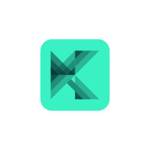

## Katrusya
[](https://shields.io/)
Katrusya is an online-course platform that uses gamification techniques to increase the completion rate of each course. The platform provides a fun and engaging learning experience that motivates users to complete courses and achieve their learning goals.

The platform is built using Flutter for the frontend, Nest.js for the backend, and MySQL for the database. The frontend provides a responsive and intuitive user interface, while the backend handles user authentication, course management, and data storage.

## Technologies
Project was created with:
[](https://shields.io/)
[](https://shields.io/)
[](https://shields.io/)

## Getting Started
To get started with Katrusya, follow these steps:

1. Clone the repository to your local machine:
   ```
   $ git clone https://github.com/zhvarikk/katrusya_project.git
   ```
2. Navigate to the project directory:
   ```
   $ cd katrusya_project
   ```
3. Install the dependencies for the frontend:
   ```
   $ cd frontend
   $ flutter pub get
   ```
4. Install the dependencies for the backend:
   ```
   $ cd ../backend
   $ npm install 
   ```
5. Start the backend server:
   ```
   $ docker-compose up
   ```
6. Start the frontend app:
   ```
   $ flutter run
   ```

The app should now be running on your local machine.

## Features
Katrusya includes the following features:
* User authentication and registration
* Course discovery and enrollment
* Course progress tracking
* Quiz-based assessments
* Leaderboard

