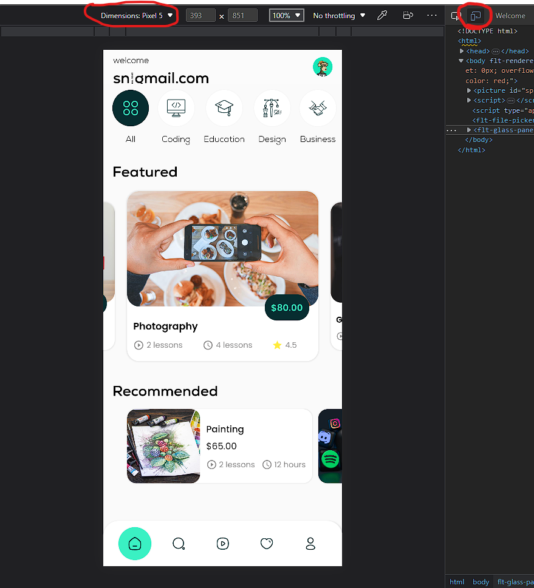

## Frontend

## Prerequisites
To run the front end make sure you have (done) the following
1. Backend and database has been installed with docker and is running 
2. You have either Edge, Google Chrome, or an android emulator using API 32 or higher (pixel 5)
3. If you are using Edge or Chrome please run/view the app using a pixel 5 device for the ideal experience. (To do this use developer mode and select pixel 5 from the dropdown menu)
   

## Getting started
If you have android studio you can run the app using main.dart as an entrypoint. 
To run the frontend without android studio, follow these steps:

1. Navigate to the project directory:
   ```
   $ cd katrusya_project
   ```
2. Install the dependencies for the frontend:
   ```
   $ cd frontend
   $ flutter pub get
   ```
3. Install the dependencies for the backend:
   ```
   $ cd ../backend
   $ npm install 
   ```
4. Start the backend docker container:
   ```
   $ docker-compose up
   ```
5. Start the frontend app:
   ```
   $ flutter run
   ```

After choosing a device to run on, the app should be started.

## Integration tests
To run integration test, follow these steps (requires android emulator):

* for the most readable result use android studio and run the following test file:
   ```
   ./integration_test/app_test.dart
   ```


* If you do not have android studio installed follow these steps: 
  1. navigate to frontend directory:
     ```
     $ cd katrusya_project/frontend
     ```
  2. open a git bash and run the following command:
     ```
     $ flutter drive \ --driver=test_driver/app_test_test.dart --target=integration_test/app_test.dart
     ```